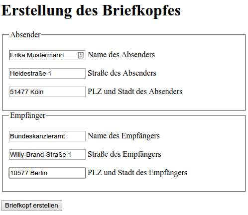

# Brieffenster-Generator

Sometimes, you just need the header.

# Screenshots

## WebUI



## The generated PDF

[Generated Briefkopf](screenshots/Generated-Briefkopf.pdf)

# Run locally

Run with `python3 brieffenster.py` or `./brieffenster.py` if you made
it executable beforehand with `chmod +x brieffenster.py` and head to
[http://127.0.0.1:5000/](http://127.0.0.1:5000/).


# Installation
To install, put `brieffenster.ini` into `/etc/uwsgi/apps-available`
and symlink it to `/etc/uwsgi/apps-enabled` with i.e.
`(cd /etc/uwsgi/apps-enabled && ln -s /etc/uwsgi/apps-available/brieffenster.ini brieffenster.ini)`

Clone the project into some folder, i.e.

```
cd /var/www \
    && mkdir -p projekte/brieffenster \
    && cd projekte/brieffenster \
    && git clone https://github.com/JonasGroeger/Brieffenster-Generator.git .
```

Since python3.4 you can create the necessary virtual environment
with `python3 -m venv`. Activate it. Then
`pip install -r requirements.txt`.

Then, include the brieffenster.conf in one of your nginx `server {…}`
blocks.

Remember to change the `SECRET_KEY` in `brieffenster.py` and
`sudo chown -R www-data /var/www/projekte/brieffenster`

Point your browser at http://localhost/projekte/brieffenster
Have fun!

# Automation
The PDF generation can be automated using a HTTP POST request, using
i.e. `curl`:

    curl -X POST 'http://localhost:5000/generate/' \
        -F "abs_name=Erika Mustermann" \
        -F "abs_street=Heidestraße 1" \
        -F "abs_city=51477 Köln" \
        -F "empf_name=Bundeskanzleramt" \
        -F "empf_street=Willy-Brand-Straße 1" \
        -F "empf_city=10577 Berlin"

# License
This project is licensed under the MIT License. See `LICENSE.md`
